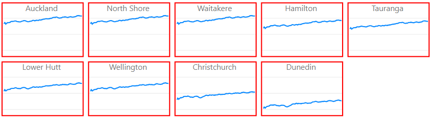

# Theming

---
[Home](../readme.md) | [Usage](./usage.md) | **Theming** | Examples | [Change Log](./change_log.md) | [Privacy Policy](./privacy_policy.md) | Support

---

Power BI has [support for theming](https://docs.microsoft.com/en-us/power-bi/desktop-report-themes). This can be extended to custom visuals with the correct application of knowledge.

* [Example](#Example)
* [Reference](#Reference)
    * [SM Layout](#SM-Layout)
    * [SM Heading](#SM-Heading)
    * [SM Styling](#SM-Styling)
    * [Line Styling](#Line-Styling)
    * [X-Axis](#X-Axis)
    * [Y-Axis](#Y-Axis)
    * [Legend](#Legend)
    * [Core Menus](#Core-Menus)

If you're familiar with using the [extended format](https://docs.microsoft.com/en-us/power-bi/desktop-report-themes#report-theme-json-file-format), you can style defaults for the visual using the `visualStyles` section.

It's often difficult to style custom visuals as it's not always easy to figure out how to read the source code for the names you need for properties, so this page intends to take some of the difficulty out of the guesswork for those who want to get straight into things. A full reference is provided after the example below.

The `visualStyles` section has to be predicated for an ID for the visual - the ID for the Small Multiple Line Chart is `smallMultipleLineChart6FA6C19AAE3840AFB9CD11A23CA7D7C7`.

## Example

To confirm what this looks like, let's do a simple example where you'd want to style the following defaults for these properties:

* SM Layout
    * Multiple Height: 100
    * Multiple Width: 150
    * Column Spacing: 10
    * Row Spacing: 10
* SM Styling
    * Border: On
    * Border Color: Red (#FF0000)
    * Border Stroke Width: 2

Your intended visual would look like this:

&nbsp;&nbsp;&nbsp;&nbsp;

The `visualStyles` definition would be set up as follows:

```json
{
    ... rest of theme ...
    "visualStyles": {
        "smallMultipleLineChart6FA6C19AAE3840AFB9CD11A23CA7D7C7DEV": {
            "*": {
                "layout": [
                    {
                        "multipleHeight": 100,
                        "multipleWidth": 150,
                        "spacingBetweenColumns": 10,
                        "spacingBetweenRows": 10
                    }
                ],
                "smallMultiple": [
                    {
                        "border": true,
                        "borderColor": {
                            "solid": {
                                "color": "#FF0000"
                            }
                        },
                        "borderStrokeWidth": 2
                    }
                ]
            }
        }
    }
}
```

## Reference

This section details all custom property menus and properties, as well as any specific details that may need to be taken into consideration.

>**Regarding min/max values** - the visual properties are designed to work with specific ranges and the properties pane has been set up to validate accordingly. It is possible to override these through the template. If you do this, and the visual doesn't behave how you expect then any issues resulting from it aren't really supported 😉

### SM Layout

Theme Property Name: `layout`

```json
"layout": [
    {
        "mode": "flow | column",
        "multipleHeight": [40-500],
        "multipleWidth": [40-500],
        "numberOfColumns" : [0-75, null],
        "spacingBetweenColumns": [0-20],
        "spacingBetweenRows": [0-20]
    }
]
```

| Field | Theme Property Name | Remarks |
|-|-|-|
| Mode | `mode` | Valid values: <ul><li>`flow` - Flow</li><li>`column` - Fixed Columns |
| Multiple Height | `multipleHeight` | Only applies when Mode = `flow`.<br> Supported ranges: `40` - `500`. |
| Multiple Width | `multipleWidth` | Only applies when Mode = `flow`.<br> Supported ranges: `40` - `500`. |
| # of Columns | `numberOfColumns` | Only applies when Mode = `column`.<br>Supported ranges: `0` - `75` or `null` for all columns.
| Column Spacing | `spacingBetweenColumns` | Supported ranges: `0` - `20`. |
| Row Spacing | `spacingBetweenRows` | SUpported ranges: `0` - `20`.<br>If using `column`, will only take effect if number of columns results in > 1 row. |

### SM Heading

Theme Property Name: `heading`

```json
"heading": [
    {
        "show": true,
        "fontColour": {
            "solid": {
                "color": "#000000"
            }
        },
        "fontColourAlternate": {
            "solid": {
                "color": "#000000"
            }
        },
        "labelPosition": "top | bottom",
        "labelAlignment" : "left | center | right",
        "fontSize": [8-60],
        "fontFamily": "Arial"
    }
]
```

| Field | Theme Property Name | Remarks |
|-|-|-|
| On/Off | `show` | |
| Font Color | `fontColour` | |
| Alternate Font Color | `fontColourAlternate` | |
| Position | `labelPosition` | |
| Alignment | `labelAlignment` | |
| Text Size | `fontSize` | |
| Font Family | `fontFamily` | |

### SM Styling

Theme Property Name: `smallMultiple`

```json
"smallMultiple": [
    {
        "backgroundColor": {
            "solid": {
                "color": "#000000"
            }
        },
        "backgroundTransparency": [0-50],
        "zebraStripe": true,
        "zebraStripeApply": "column | row | multiple",
        "backgroundColorAlternate": {
            "solid": {
                "color": "#000000"
            }
        },
        "border": true,
        "borderColor" : {
            "solid": {
                "color": "#000000"
            }
        },
        "borderStrokeWidth": [1-5],
        "borderStyle": "dashed | solid | dotted"
    }
]
```

| Field | Theme Property Name | Remarks |
|-|-|-|
| Background Color | `backgroundColor` | |
| Transparency | `backgroundTransparency` | |
| Alternate Background | `zebraStripe` | |
| Color By | `zebraStripeApply` | |
| Alternate Background Color | `backgroundColorAlternate` | |
| Border | `border` | |
| Border Color | `borderColor` | |
| Border Stroke Width | `borderStrokeWidth` | |
| Border Style | `borderStyle` | |

### Line Styling

Theme Property Name: `lineStyle`

| Field | Theme Property Name | Remarks |
|-|-|-|

### X-Axis

Theme Property Name: `xAxis`

| Field | Theme Property Name | Remarks |
|-|-|-|

### Y-Axis

Theme Property Name: `yAxis`

| Field | Theme Property Name | Remarks |
|-|-|-|

### Legend

Theme Property Name: `legend`

| Field | Theme Property Name | Remarks |
|-|-|-|

### Core Menus

The following property menus are the same as for core visuals and should not need any special consideration for theming, i.e. the documented properties in the Power BI help should be transferrable:

* Legend
* Title
* Background
* Lock aspect 
* General
* Border
* Tooltip
* Visual Header