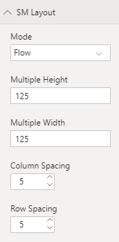
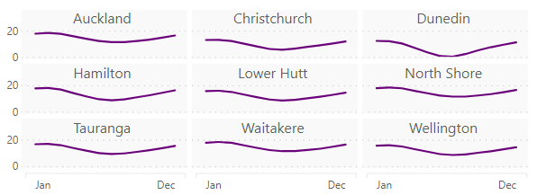
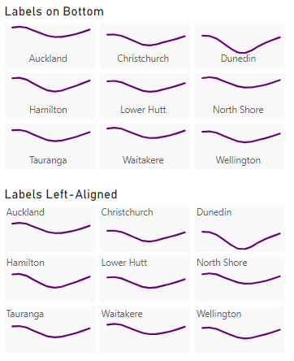
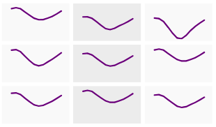
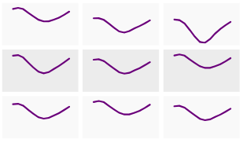
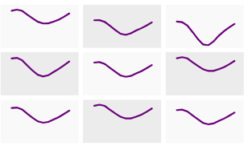
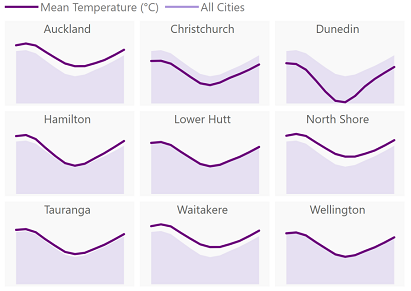

# Usage

---
[Home](../readme.md) | **Usage** | [Theming](./theming.md) | Examples | [Change Log](./change_log.md) | [Privacy Policy](./privacy_policy.md) | [Support](./support.md)

---

Where possible, the visual utilises properties and concepts common to typical Power BI visuals but there are some specific properties that you might be able to get more use out of if you have a read through this page.

* [Fields](#Fields)
* [Small Multiples](#Small-Multiples)
    * [SM Layout](#SM-Layout)
    * [SM Heading](#SM-Heading)
    * [SM Styling](#SM-Styling)
* [Line Styling](#Line-Styling)
* [Additional Features](#Additional-Features)
    * [Y-Axis](#Y-Axis)
    * [X-Axis](#X-Axis)
    * [Legend](#Legend)

## Fields

In order to plot a chart, you will need the following added to the visual fields:

| Field | Purpose | Requirements | Max. Data Points | Data Reduction Algorithm* |
| ----- | ------- | ---------- | ---------------- | ------------------------- |
| Small Multiple | Field to partition your data, or chart by, based on its unique values. If supplying more than one field, you can drill/expand. | One or More | 100 | Top |
| Axis | Field to plot on the x-axis of your chart. | One | 300 | Sample |
| Values | Measures to plot on your charts. | One or more | | |

If the above requirements are not met, then the chart will not render for you.

> *\* The Data Reduction Algorithm applies if the number of data points for that field are exceeded. This is to keep the rendered chart sensible for lots of data. In these cases, it is suggested that you create multiple instances of the chart if you wish to exceed these amounts.*
>
> *For an overview of how these data reduction algorithms are applied, you can refer to the [PowerBI-Visuals documentation](https://docs.microsoft.com/en-nz/power-bi/developer/visuals/dataview-mappings#data-reduction-algorithm-types).*

## Small Multiples

There are three property menus that govern the behaviour of small multiples in the visual:

### SM Layout

The **SM Layout** menu allows you to configure the layout of the 'grid' of small multiples. The behavior of the grid is specified by using **Column Sizing** and **Row Sizing**, and their associated properties.

**Column Sizing** has two settings:

* **Fixed Width** (default) - specify a width for each small multiple, in pixels.
* **Fixed # Columns** - specify a number of columns to fit in each row.

**Row Sizing** has 2 settings:

* **Fixed Height** (default) - specify a height for each small multiple, in pixels.
* **Divide Evenly** - divide the row height evenly, over the height of the visual.

Specifying a **Multiple Height** or **Multiple Width** allows you to guarantee the sizing of the particular dimension of your small multiples, if you are unsure as to how many will be displayed in the visual at one time (for example, if your report contains interactions and users may be doing their own filtering).

* The **Multiple Height** and **Multiple Width** fields have a minimum value of **40** and a maximum value of **500** pixels.
* Small multiples will wrap onto the next row once the number of small multiples that fit into row width ÷ small multiple width have been reached.
* If specifying **Fixed Height** and the number of small multiples is sufficient to exceed the height of the visual, it will add a vertical scrollbar to accommodate.
* Specifying **Fixed # Columns** will automatically fit the specified number of columns across the width of your visual, unless the minimum calculated size is less than **40** pixels, and the visual will scroll horizontally.
* Specifying **Divide Evenly** will cause the visual container to scroll if the calculated row height is lower than **40** pixels.

The following example illustrates specifying width and height - the visual will fit as many as possible before moving onto the next row (visual border included to help illustrate). Properties are as follows:

* Column Sizing: **Fixed Width**
* Row Sizing: **Fixed Height**
* Multiple Width: **75** pixels
* Multiple Height: **75** pixels

&nbsp;&nbsp;&nbsp;&nbsp;

The example below uses the same data, but fits **3** columns per row and uses **Divide Evenly** for row sizing:

&nbsp;&nbsp;&nbsp;&nbsp;

### SM Heading

The **SM Heading** menu allows you to configure the heading displayed on the small multiple.

* Headings can be positioned at either the top or the bottom of the small multiple.
* If **Alternate Background Color** is enabled in the [**SM Styling**](#SM-Styling) property menu, then you can also specify an **Alternate Font Color** for the heading, which will use the same **Color By** rule.

&nbsp;&nbsp;&nbsp;&nbsp;

### SM Styling

The **SM Styling** menu allows you to specify background and border configuration to the small multiples.

You can also apply an alternating background by setting the **Alternate Background Color** property. This will provide you with the option to set a color and also a **Color By** rule, which provides the following options:

* **Column** - the color is applied to each alternate column within each row.
 
* **Row** - the color is applied to every small multiple in each alternate row.
 
* **Small Multiple** - the color is applied to each alternate small multiple, across the whole visual. If you have an even number of small multiples in a row, this can look very similar to **Column**.
 

## Line Styling

The **Line Styling** menu allows you to tailor the appearence of the line produced for each measure in  your visual, consitently across each small multiple.

* **Color** - allows you to specify the color for each measure.
* **Stroke Width** - allows you to specify a particular width for your measure. You can set this to **0** to hide the line if you just wish to use **Show Area** for your measure.
* **Show Area** - allows you to render a measure as an area chart. A **Transparency** option is also exposed if this property is enabled.
* **Shape** - allows you to specify how the line is drawn. Values are as follows:
    * **Linear** (default) - data points are connected by a straight line.
    * **Stepped** - changes between each data point are drawn using vertical lines before drawing a horizontal line for the value.
    * **Curve (Natural)** - produces a [natural cubic spline](https://en.wikipedia.org/wiki/Spline_interpolation) over data points.
    * **Curve (Cardinal)** - produces a [cardinal spline](https://en.wikipedia.org/wiki/Cubic_Hermite_spline#Cardinal_spline) over data points.
* **Style** - allows you to specify the style of the line for each measure. Values are:
    * **Dashed**
    * **Solid** (default)
    * **Dotted**
    * **Dot-Dash**

The example below uses line styling to place a less subtle measure that shows the mean temperature for all cities within each small multiple, allowing it to be compared visually.

&nbsp;&nbsp;&nbsp;&nbsp;

Here's the same example using the **Area** option for the second measure, and a **Stroke Width** of **0**:

&nbsp;&nbsp;&nbsp;&nbsp;

## Additional Features

### Y-Axis

The behaviour and configuration of the chart's Y-axis is very much the same as a standard line chart, with a few small considerations. The Y-axis comprises the following three components:

| Component | Remarks |
| --------- | ------- |
| Labels | To reduce clutter, axis labels are displayed at the start of each row of small multiples. |
| Title | The title is vertically centered across the visual viewport. |
| Gridlines | Gridlines are displayed within the confines of each small multiple. They are not shown across column spacing, so if you want a continuous line then it is advisable to set spacing to **0**. | 

> ℹ *Disabling an axis in the properties pane will prevent you from setting any properties for it, which is why the components have individual on/off switches.*

### X-Axis

The X-axis settings work much the same as the Y-axis. The one exception being that labels are displayed once per column and have an **Axis Domain Line** setting that can be used to toggle on a visual axis line for each one.

### Legend

Legends work very much the same as standard chart legends; the only exception being the **Include Range as Suffix** switch, which will add the min/max X-axis range values as a suffix to the title text.