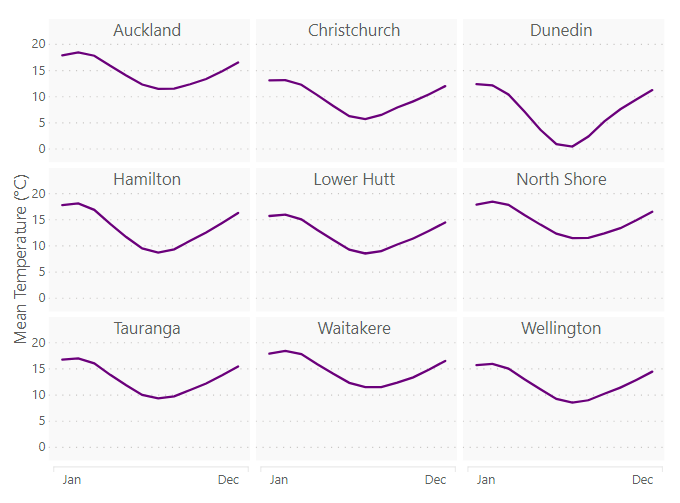

# Small Multiple Line Chart for Power BI

By Daniel Marsh-Patrick

 [dm-p](https://github.com/dm-p) &nbsp;&nbsp;&nbsp;&nbsp;&nbsp;  [@the_d_mp](https://twitter.com/the_d_mp) &nbsp;&nbsp;&nbsp;&nbsp;&nbsp;   [daniel-m-p](https://www.linkedin.com/in/daniel-m-p)  &nbsp;&nbsp;&nbsp;&nbsp;&nbsp; www.coacervo.co  |  [daniel@coacervo.co](mailto:daniel@coacervo.co) 

----
**Home** | [Usage](./doc/usage.md) | [Theming](./doc/theming.md) | Examples | [Change Log](./doc/change_log.md) | [Privacy Policy](./doc/privacy_policy.md) | [Support](./doc/support.md)

----

## Current Status

| | Development | Submitted | Approved | Available |
|-|:--:|:-:|:-:|:-:|
| [2.2.0.133](./doc/change_log.md#220133-2020-08-28) | | 🕰 | | |
| [2.1.0.130](./doc/change_log.md#210130-2020-04-15) | | | | ✔ |

> **If a version is in any status other than *Available* this cannot be imported via file or via the Marketplace, even if the listing is showing the new version**. [More on this below](#More-About-Current-Status).

## What the Visual Does

A small multiple is a series of charts using the same scale and axes, allowing them to be easily compared. This visual allows you to take a measure you might normally plot in a line chart, and duplicate this for the values of another category, e.g.:

&nbsp;&nbsp;&nbsp;&nbsp;

In this example, we are able to take a measure - **Mean Temperature (°C)** - plotted by **Month Name** and then split this out into individual charts by a category (**City**). 

Each small multiple uses the same X and Y scale to allow for consistent visual comparison between categories.

## Obtaining the Visual

The latest version of the visual is **2.1.0.130**.

The visual is [available in AppSource](https://appsource.microsoft.com/en-us/product/power-bi-visuals/WA104381711?src=website&mktcmpid=repo_main_page) (Power BI Marketplace). You can also download from this repository's [Releases section](https://github.com/dm-p/powerbi-visuals-smlc/releases).

Please read the below or review the [Current Status](#Current-Status) table prior to attempting to load a version other then the one in the Marketplace, [or refer to this excellent article by OKViz](https://okviz.com/blog/updating-power-bi-custom-visuals/), which explains the process in much more detail.

## More About Current Status

Custom visuals have a somewhat unconventional path to the Marketplace, and the [Current Status](#Current-Status) table above tries to mirror this as simply as possible. This process takes as long as it takes and is entirely dependent on the current backlog of work with the Custom Visuals Team at Microsoft.

If a custom visual is published to the Marketplace, **it will always be loaded from there**, even if you manually upload a specific version into your report. This is to ensure that reports are always using the latest version and the user doesn't have to manually upgrade all reports containing a particular visual when new versions become available.

If you want to load a version of this visual before it's fully available (or downgrade), you'll need to use [organizational custom visuals](https://docs.microsoft.com/en-us/power-bi/power-bi-custom-visuals-organization) in conjunction with your administrator, which will prioritise the version in your tenant over the one in the Marketplace.

Here's a bigger explanation for anyone who wants to know about what each status means:

* **Development** - the specified version is undergoing active development and is not in the AppSource/Marketplace ecosystem. Development builds may be available via releases [Releases](https://github.com/dm-p/powerbi-visuals-smlc/releases) or can be compiled from source.
* **Submitted** - the visual has been submitted to AppSource and is undergoing initial review.
* **Approved** - the visual listing is updated **but not yet fully available while MS do internal testing and verification**.
* **Available** - the visual is fully available and can be obtained from the marketplace as normal. Any reports using the visual will be automatically updated.
